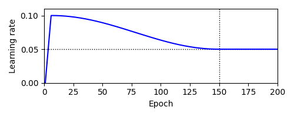

# Stochastic Weight Averaging (SWA)

This repository is the unofficial implementation of [Averaging Weights Leads to Wider Optima and Better Generalization](https://arxiv.org/abs/1803.05407) (UAI 2018).
The official code can be found [here](https://github.com/timgaripov/swa).

## Command Lines

This projet is built on [giung2-jax](https://github.com/cs-giung/giung2-jax).
```
ln -s /path/to/giung2-jax/giung2 ./
ln -s /path/to/giung2-jax/datasets ./
```

### Train Models

Run the following command lines to train models with SWA:
```
python scripts/train_swa.py \
    --config_file ./configs/{DATASET_NAME}_{NETWORK_NAME}.yaml \
    --num_epochs {EPOCH} --num_warmup_epochs 5 \
    --batch_size 128 --learning_rate 0.1 --weight_decay 5e-4 \
    --swa_num_pt_epochs {PRETRAIN_EPOCH} --swa_learning_rate {SWA_LR} \
    --seed 42 --output_dir ./outputs/{DATASET_NAME}_{NETWORK_NAME}/SWA/e{EPOCH}_pt{PRETRAIN_EPOCH}_lr{SWA_LR}_s42
```

The following figure depicts the learning rate schedule when we use `learning_rate=0.1`, `num_epochs=200`, `num_warmup_epochs=5`, `swa_num_pt_epochs=150`, and `swa_learning_rate=0.05`.
SWA averages parameters at every epoch from 151 to 200 epochs.



### Evaluate Models

Run the following command lines to evaluate models:
```
python scripts/eval_swa.py \
    --config_file ./configs/{DATASET_NAME}_{NETWORK_NAME}.yaml \
    --weight_file ./outputs/path/to/best_acc1
```

## Results

Refer to [`scripts/logs/README.md`](./scripts/logs/README.md) to view full results of the experiments.

### CIFAR-10 (R20-BN-ReLU)
| Epoch | Pretrain Epoch | SWA LR | Train ACC / NLL / cNLL | Valid ACC / NLL / cNLL | Test ACC / NLL / cNLL  |
| :-:   | :-:            | :-:    | :-:                    | :-:                    | :-:                    |
| 200   | 200            | -      | 99.91 / 0.007 / 0.031  | 92.98 / 0.272 / 0.224  | 92.49 / 0.274 / 0.229  |
|       | 150            | 0.05   | 96.71 / 0.101 / 0.106  | 93.32 / 0.210 / 0.209  | 92.28 / 0.223 / 0.221  |
|       | 150            | 0.02   | 98.78 / 0.043 / 0.058  | 93.48 / 0.208 / 0.199  | 92.90 / 0.217 / 0.208  |
|       | 150            | 0.01   | 99.27 / 0.028 / 0.048  | 93.18 / 0.228 / 0.209  | 92.89 / 0.232 / 0.214  |
| 400   | 400            | -      | 99.98 / 0.004 / 0.022  | 93.34 / 0.266 / 0.220  | 92.79 / 0.273 / 0.228  |
|       | 300            | 0.05   | 96.98 / 0.092 / 0.097  | 93.30 / 0.200 / 0.199  | 92.78 / 0.218 / 0.216  |
|       | 300            | 0.02   | 99.17 / 0.031 / 0.046  | 94.04 / 0.196 / 0.185  | 93.27 / 0.216 / 0.203  |
|       | 300            | 0.01   | 99.70 / 0.016 / 0.033  | 93.60 / 0.212 / 0.193  | 93.41 / 0.220 / 0.200  |

### CIFAR-100 (R20-BN-ReLU)
| Epoch | Pretrain Epoch | SWA LR | Train ACC / NLL / cNLL | Valid ACC / NLL / cNLL | Test ACC / NLL / cNLL  |
| :-:   | :-:            | :-:    | :-:                    | :-:                    | :-:                    |
| 200   | 200            | -      | 92.42 / 0.274 / 0.385  | 68.84 / 1.210 / 1.121  | 68.22 / 1.228 / 1.136  |
|       | 150            | 0.05   | 80.67 / 0.651 / 0.677  | 69.20 / 1.078 / 1.067  | 69.42 / 1.074 / 1.063  |
|       | 150            | 0.02   | 86.03 / 0.469 / 0.520  | 69.42 / 1.076 / 1.048  | 70.17 / 1.060 / 1.035  |
|       | 150            | 0.01   | 88.94 / 0.379 / 0.452  | 70.28 / 1.108 / 1.060  | 69.86 / 1.089 / 1.048  |
| 400   | 400            | -      | 95.70 / 0.175 / 0.306  | 68.40 / 1.270 / 1.144  | 68.15 / 1.276 / 1.147  |
|       | 300            | 0.05   | 81.60 / 0.616 / 0.648  | 68.70 / 1.077 / 1.061  | 69.64 / 1.043 / 1.033  |
|       | 300            | 0.02   | 87.53 / 0.430 / 0.482  | 70.34 / 1.054 / 1.026  | 69.84 / 1.061 / 1.031  |
|       | 300            | 0.01   | 90.36 / 0.327 / 0.411  | 70.20 / 1.116 / 1.057  | 70.47 / 1.091 / 1.041  |

### CIFAR-10 (WRN28x10-BN-ReLU)
| Epoch | Pretrain Epoch | SWA LR | Train ACC / NLL / cNLL | Valid ACC / NLL / cNLL | Test ACC / NLL / cNLL  |
| :-:   | :-:            | :-:    | :-:                    | :-:                    | :-:                    |
| 200   | 200            | -      | 100.0 / 0.000 / 0.010  | 96.18 / 0.177 / 0.146  | 96.08 / 0.170 / 0.142  |
|       | 150            | 0.05   | 99.89 / 0.007 / 0.012  | 96.56 / 0.115 / 0.109  | 96.10 / 0.121 / 0.114  |
|       | 150            | 0.02   | 100.0 / 0.000 / 0.005  | 96.68 / 0.121 / 0.104  | 96.42 / 0.126 / 0.109  |
|       | 150            | 0.01   | 100.0 / 0.000 / 0.006  | 96.38 / 0.135 / 0.113  | 96.69 / 0.137 / 0.115  |
| 300   | 300            | -      | 100.0 / 0.001 / 0.011  | 96.32 / 0.168 / 0.143  | 96.40 / 0.163 / 0.140  |
|       | 225            | 0.05   | 99.90 / 0.006 / 0.012  | 96.64 / 0.112 / 0.106  | 96.38 / 0.120 / 0.113  |
|       | 225            | 0.02   | 100.0 / 0.000 / 0.005  | 96.70 / 0.121 / 0.104  | 96.76 / 0.125 / 0.107  |
|       | 225            | 0.01   | 100.0 / 0.000 / 0.007  | 96.52 / 0.140 / 0.115  | 96.74 / 0.135 / 0.112  |

### CIFAR-100 (WRN28x10-BN-ReLU)
| Epoch | Pretrain Epoch | SWA LR | Train ACC / NLL / cNLL | Valid ACC / NLL / cNLL | Test ACC / NLL / cNLL  |
| :-:   | :-:            | :-:    | :-:                    | :-:                    | :-:                    |
| 200   | 200            | -      | 99.98 / 0.001 / 0.004  | 80.04 / 0.900 / 0.844  | 80.63 / 0.843 / 0.802  |
|       | 150            | 0.05   | 99.62 / 0.014 / 0.033  | 80.90 / 0.797 / 0.677  | 81.32 / 0.769 / 0.660  |
|       | 150            | 0.02   | 99.98 / 0.001 / 0.006  | 81.54 / 0.860 / 0.706  | 81.70 / 0.832 / 0.689  |
|       | 150            | 0.01   | 99.98 / 0.000 / 0.004  | 80.90 / 0.838 / 0.742  | 81.48 / 0.812 / 0.729  |
| 300   | 300            | -      | 99.99 / 0.001 / 0.003  | 80.40 / 0.878 / 0.842  | 80.38 / 0.861 / 0.830  |
|       | 225            | 0.05   | 99.72 / 0.010 / 0.026  | 81.50 / 0.815 / 0.670  | 81.65 / 0.782 / 0.655  |
|       | 225            | 0.02   | 99.98 / 0.000 / 0.005  | 81.24 / 0.883 / 0.725  | 81.71 / 0.837 / 0.693  |
|       | 225            | 0.01   | 99.98 / 0.000 / 0.004  | 81.28 / 0.858 / 0.753  | 81.61 / 0.827 / 0.733  |

### TinyImageNet-200 (R18-BN-ReLU)
| Epoch | Pretrain Epoch | SWA LR | Train ACC / NLL / cNLL | Valid ACC / NLL / cNLL | Test ACC / NLL / cNLL  |
| :-:   | :-:            | :-:    | :-:                    | :-:                    | :-:                    |
| 100   | 100            | -      | 99.98 / 0.005 / 0.022  | 66.07 / 1.544 / 1.459  | 65.52 / 1.581 / 1.486  |
|       |  75            | 0.05   | 87.36 / 0.460 / 0.520  | 67.68 / 1.361 / 1.302  | 67.30 / 1.389 / 1.322  |
|       |  75            | 0.02   | 98.48 / 0.070 / 0.143  | 67.87 / 1.448 / 1.309  | 67.91 / 1.483 / 1.330  |
|       |  75            | 0.01   | 99.88 / 0.012 / 0.048  | 67.17 / 1.505 / 1.362  | 66.86 / 1.540 / 1.384  |
| 200   | 200            | -      | 99.98 / 0.002 / 0.007  | 66.57 / 1.529 / 1.489  | 65.12 / 1.585 / 1.535  |
|       | 150            | 0.05   | 89.21 / 0.388 / 0.455  | 68.69 / 1.348 / 1.266  | 67.83 / 1.388 / 1.296  |
|       | 150            | 0.02   | 99.46 / 0.028 / 0.082  | 68.53 / 1.485 / 1.304  | 68.04 / 1.512 / 1.325  |
|       | 150            | 0.01   | 99.96 / 0.004 / 0.024  | 67.78 / 1.533 / 1.362  | 67.14 / 1.563 / 1.379  |
| 300   | 300            | -      | 99.98 / 0.001 / 0.003  | 66.52 / 1.551 / 1.532  | 65.71 / 1.583 / 1.559  |
|       | 225            | 0.05   | 89.72 / 0.369 / 0.439  | 68.97 / 1.353 / 1.265  | 68.49 / 1.366 / 1.276  |
|       | 225            | 0.02   | 99.66 / 0.019 / 0.066  | 68.80 / 1.489 / 1.297  | 67.67 / 1.546 / 1.332  |
|       | 225            | 0.01   | 99.98 / 0.002 / 0.017  | 68.32 / 1.544 / 1.360  | 67.50 / 1.601 / 1.394  |

## License

[The MIT License](./LICENSE).
